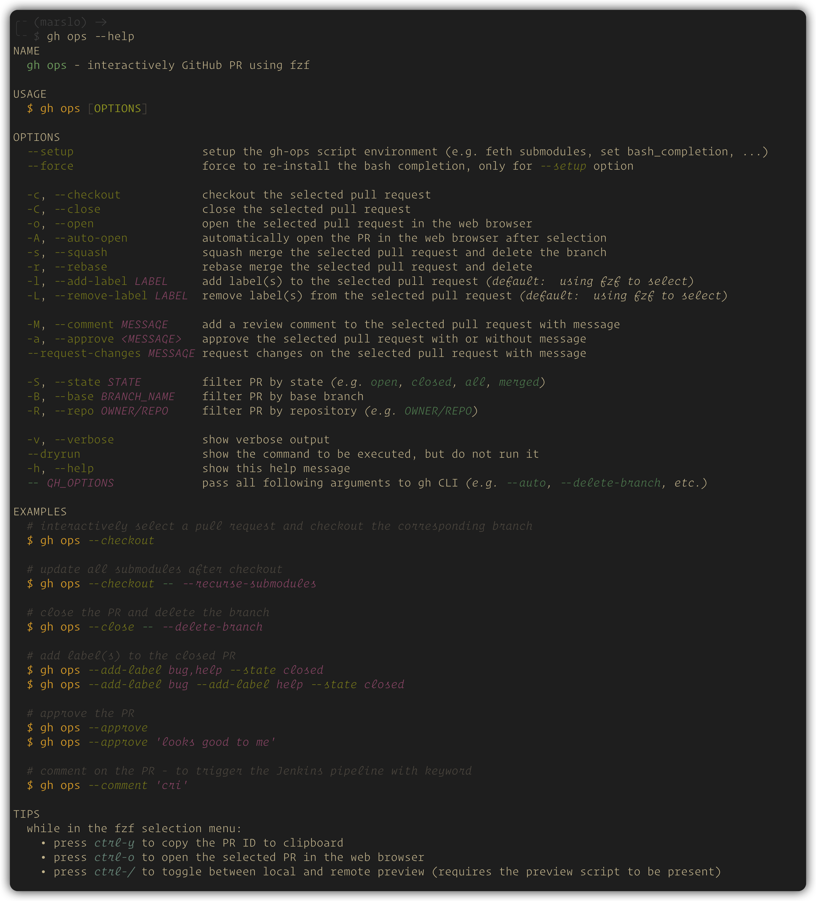

# gh-ops

A GitHub CLI extension for interactively managing Pull Requests via fzf.

---

[](https://github.com/marslo/gh-ops/actions/workflows/pre-commit.yml)


---

# features

- **Interactive PR selection** powered by fzf with rich preview
- **Checkout, close, merge** (squash / rebase) a PR in one command
- **Label management** — add or remove labels interactively or by name
- **Review workflow** — approve, comment, or request changes
- **Draft / Ready conversion** — toggle PR status without leaving the terminal
- **Flexible filtering** — by state, base branch, or repository
- **Pass-through** — forward any extra flags directly to the native `gh pr` CLI

---

## requirements

| TOOL                                   | VERSION |
|----------------------------------------|---------|
| [gh](https://cli.github.com/)          | ≥ 2.36  |
| [fzf](https://github.com/junegunn/fzf) | ≥ 0.60  |
| bash                                   | ≥ 4.0   |

# install

```bash
gh extension install marslo/gh-ops
```

## setup (submodules + bash completion)

```bash
gh ops --setup
```

```bash
# `--force` re-install the bash completion
gh ops --setup --force
```

## add following to your `~/.bashrc` or `~/.bash_profile` to enable bash completion for `gh ops`:
```bash
# 1. gh native completion must be sourced first
eval "$(gh completion -s bash)"
source "${BASH_COMPLETION_USER_DIR:-${HOME}/.local/share/bash-completion}/gh-ops.sh"
```

# usage



## options

| FLAG                         | DESCRIPTION                                                       |
|------------------------------|-------------------------------------------------------------------|
| `-c`, `--checkout`           | Checkout the selected PR *(default)*                              |
| `-C`, `--close`              | Close the selected PR                                             |
| `-o`, `--open`               | Open the selected PR in the browser                               |
| `-A`, `--auto-open`          | Auto-open the current branch's PR in browser                      |
| `-s`, `--squash`             | Squash-merge the selected PR and delete branch                    |
| `-r`, `--rebase`             | Rebase-merge the selected PR and delete branch                    |
| `-l`, `--add-label LABEL`    | Add label(s) — omit `LABEL` to pick interactively                 |
| `-L`, `--remove-label LABEL` | Remove label(s) — omit `LABEL` to pick interactively              |
| `-M`, `--comment MESSAGE`    | Add a review comment with `MESSAGE`                               |
| `-a`, `--approve [MESSAGE]`  | Approve the PR, optionally with a message                         |
| `--request-changes MESSAGE`  | Request changes with `MESSAGE`                                    |
| `--ready`                    | Convert PR from draft → ready for review                          |
| `--draft`                    | Convert PR from ready → draft                                     |
| `-S`, `--state STATE`        | Filter by state: `open` / `closed` / `all` / `merged`             |
| `-B`, `--base BRANCH`        | Filter by base branch                                             |
| `-R`, `--repo OWNER/REPO`    | Target a specific repository                                      |
| `-v`, `--verbose`            | Show verbose output                                               |
| `--dryrun`                   | Print the command without executing it                            |
| `-h`, `--help`               | Show help                                                         |
| `--` `GH_OPTIONS`            | Pass remaining args to `gh pr` (e.g. `--auto`, `--delete-branch`) |

## fzf Key Bindings (inside the selection menu)

| KEY      | ACTION                      |
|----------|-----------------------------|
| `ctrl-y` | Copy PR ID to clipboard     |
| `ctrl-o` | Open selected PR in browser |
| `ctrl-/` | Toggle preview window       |
| `ctrl-\` | Toggle preview window       |

---

# License

MIT
